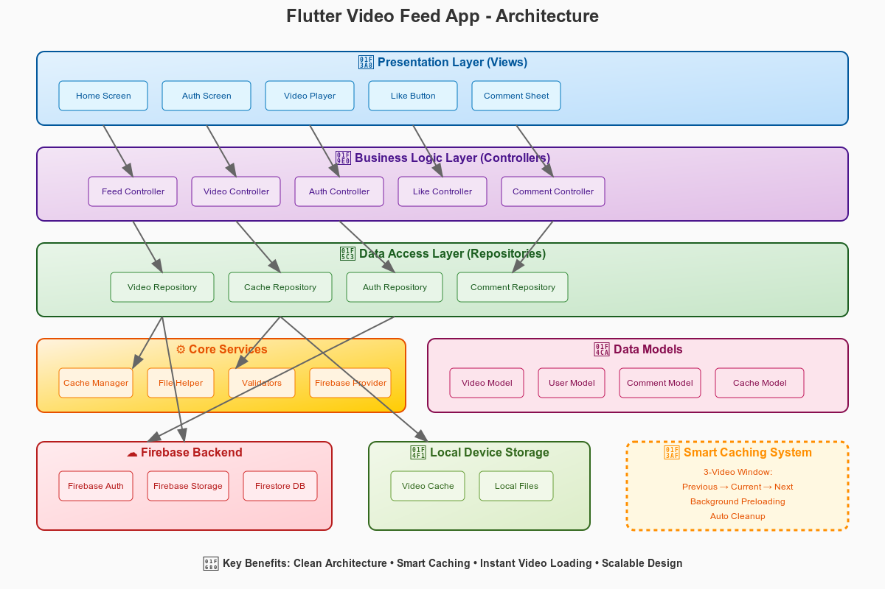

# tiktok_clone

A new Flutter project.

---



---

## 🚀 Firebase Setup Instructions

1. **Create a Firebase Project**
   - Go to [Firebase Console](https://console.firebase.google.com/).
   - Click "Add project" and follow the steps.

2. **Register Your App**
   - Add an Android app (use your app's package name, e.g., `com.example.tiktok_clone`).
   - Download `google-services.json` and place it in `android/app/`.
   - For iOS, add your app and download `GoogleService-Info.plist` to `ios/Runner/`.

3. **Enable Firebase Services**
   - **Authentication:** Enable Email/Password and Anonymous sign-in in the Firebase Console.
   - **Firestore:** Create a Firestore database (start in test mode for development).
   - **Storage:** Enable Firebase Storage if you plan to use cloud video uploads.

4. **FlutterFire CLI (Optional but recommended)**
   - Install: `dart pub global activate flutterfire_cli`
   - Configure: `flutterfire configure`
   - This generates `lib/firebase_options.dart` for multi-platform support.

5. **Update Android SDK Version**
   - In `android/app/build.gradle`, set `minSdkVersion` to **23** or higher:
     ```gradle
     defaultConfig {
         minSdkVersion 23
         // ...
     }
     ```

---

## ▶️ How to Run the App

1. **Install Dependencies**
   ```sh
   flutter pub get
   ```

2. **(If using local videos) Add Assets**
   - Place your `.mp4` files in `assets/videos/`.
   - Update `pubspec.yaml`:
     ```yaml
     flutter:
       assets:
         - assets/videos/
     ```

3. **Run on Emulator or Device**
   ```sh
   flutter run
   ```

---

## 🗂️ Caching & Architecture Decisions

### Clean Architecture

- **Presentation Layer:** Screens/widgets (UI)
- **Business Logic Layer:** Controllers (e.g., AuthController, FeedController)
- **Data Access Layer:** Repositories (e.g., AuthRepository, VideoRepository)
- **Core Services:** Utilities, cache manager, validators, Firebase provider
- **Data Models:** User, Video, Comment, Cache models
- **Backend:** Firebase Auth, Firestore, Storage
- **Local Storage:** Video cache, local files

See the architecture diagram above for a visual overview.

---

### Local Video Caching (Local-Only Mode)

**Folder Structure:**
```
assets/
└── videos/
    ├── video1.mp4
    ├── video2.mp4
    └── video3.mp4
```

**pubspec.yaml:**
```yaml
flutter:
  assets:
    - assets/videos/
```

**Video Model:**
```dart
class LocalVideo {
  final String id;
  final String assetPath;
  final String title;
  int likes;
  bool isLiked;

  LocalVideo({
    required this.id,
    required this.assetPath,
    required this.title,
    this.likes = 0,
    this.isLiked = false,
  });
}
```

**Repository:**
```dart
class LocalVideoRepository {
  final List<LocalVideo> _videos = [
    LocalVideo(
      id: '1',
      assetPath: 'assets/videos/video1.mp4',
      title: 'Funny Cat',
    ),
    LocalVideo(
      id: '2', 
      assetPath: 'assets/videos/video2.mp4',
      title: 'Dancing Dog',
    ),
  ];

  List<LocalVideo> getVideos() => _videos;

  void toggleLike(String videoId) {
    final video = _videos.firstWhere((v) => v.id == videoId);
    video.isLiked = !video.isLiked;
    video.likes += video.isLiked ? 1 : -1;
  }
}
```

**Video Player Widget:**
```dart
class LocalVideoPlayer extends StatefulWidget {
  final String assetPath;

  const LocalVideoPlayer({super.key, required this.assetPath});

  @override
  State<LocalVideoPlayer> createState() => _LocalVideoPlayerState();
}

class _LocalVideoPlayerState extends State<LocalVideoPlayer> {
  late VideoPlayerController _controller;

  @override
  void initState() {
    super.initState();
    _initVideo();
  }

  Future<void> _initVideo() async {
    _controller = VideoPlayerController.asset(widget.assetPath)
      ..initialize().then((_) {
        setState(() {});
        _controller.play();
        _controller.setLooping(true);
      });
  }

  @override
  Widget build(BuildContext context) {
    return _controller.value.isInitialized
        ? AspectRatio(
            aspectRatio: _controller.value.aspectRatio,
            child: VideoPlayer(_controller),
          )
        : const Center(child: CircularProgressIndicator());
  }

  @override
  void dispose() {
    _controller.dispose();
    super.dispose();
  }
}
```

**Video Feed:**
```dart
class LocalVideoFeed extends StatefulWidget {
  const LocalVideoFeed({super.key});

  @override
  State<LocalVideoFeed> createState() => _LocalVideoFeedState();
}

class _LocalVideoFeedState extends State<LocalVideoFeed> {
  final LocalVideoRepository _repository = LocalVideoRepository();
  final PageController _pageController = PageController();

  @override
  Widget build(BuildContext context) {
    final videos = _repository.getVideos();

    return Scaffold(
      body: PageView.builder(
        controller: _pageController,
        scrollDirection: Axis.vertical,
        itemCount: videos.length,
        itemBuilder: (context, index) {
          final video = videos[index];
          return Stack(
            children: [
              LocalVideoPlayer(assetPath: video.assetPath),
              Positioned(
                bottom: 20,
                right: 20,
                child: Column(
                  children: [
                    IconButton(
                      icon: Icon(
                        video.isLiked ? Icons.favorite : Icons.favorite_border,
                        color: Colors.red,
                      ),
                      onPressed: () {
                        setState(() {
                          _repository.toggleLike(video.id);
                        });
                      },
                    ),
                    Text('${video.likes}'),
                  ],
                ),
              ),
            ],
          );
        },
      ),
    );
  }
}
```

**Main App:**
```dart
void main() {
  runApp(const MyApp());
}

class MyApp extends StatelessWidget {
  const MyApp({super.key});

  @override
  Widget build(BuildContext context) {
    return MaterialApp(
      home: LocalVideoFeed(), // Directly show local video feed
    );
  }
}
```

---

### Key Caching Decisions

- **No Firebase Storage:** Videos are bundled with the app for instant access.
- **In-Memory Likes:** Like counts are stored in memory and reset on app restart.
- **No Firestore Dependency:** All video data is local; no cloud sync.
- **Asset Player:** Uses `VideoPlayerController.asset()` for local playback.
- **Scalable Design:** The architecture supports swapping in cloud storage and Firestore for production.

---

### How to Add More Videos

1. Add `.mp4` files to `assets/videos/`.
2. Update `LocalVideoRepository` with new entries.

---

### Limitations (Local-Only Mode)

- Videos are fixed at build time (no dynamic downloads).
- Like counts reset on app restart.
- No user accounts (anonymous likes only).

---

## 📚 Notes

- For production, you can switch to Firebase Storage and Firestore for dynamic video feeds and persistent likes.
- The architecture is designed for easy scaling and swapping between local and cloud data sources.

---
